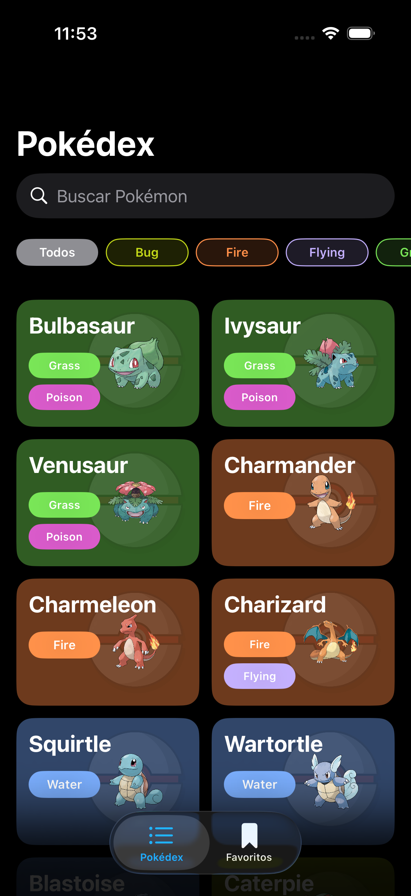
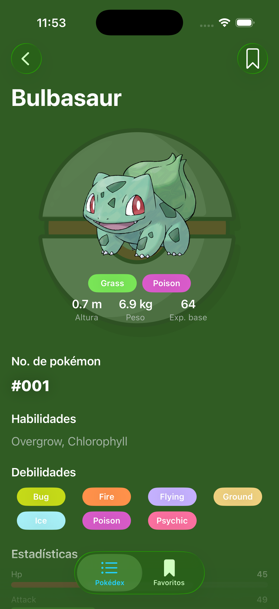
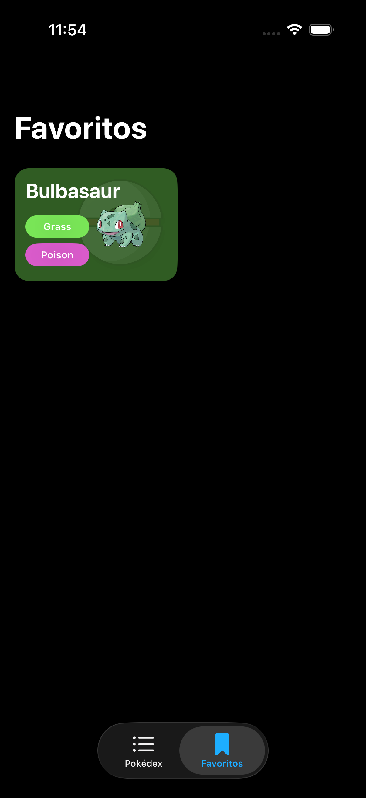

# Pokédex

Reto técnico iOS: listado de Pokémon con búsqueda y filtro por tipo, pantalla de detalle con evoluciones y debilidades, favoritos con persistencia local, y soporte offline básico. Construido con SwiftUI, Clean Architecture y MVVM.

<p align="center">
  
  
  
</p>

## Cómo correrlo

- Xcode 26 (o el que traiga soporte para Swift Testing y `@Observable`).
- No hay dependencias externas que instalar — el proyecto no usa SPM/CocoaPods/Carthage, solo frameworks del sistema.

```
open Pokedex.xcodeproj
```

Selecciona el scheme **Pokedex**, un simulador de iPhone, y corre con `Cmd+R`. La app consume la API pública en vivo (`https://pokeapi.co`), así que necesita conexión a internet la primera vez que carga cada pantalla.

### Tests

```
Cmd+U
```

o desde terminal:

```
xcodebuild test -project Pokedex.xcodeproj -scheme Pokedex \
  -destination 'platform=iOS Simulator,name=iPhone 17' \
  -only-testing:PokedexTests
```

## Arquitectura

Clean Architecture con 3 capas, cada una dependiendo solo de la de adentro:

```
Presentation → Domain ← Data
```

- **Domain** — entidades, protocolo `PokemonRepository`, casos de uso. Swift puro (solo `Foundation` para tipos básicos como `URL`), sin `SwiftUI` ni nada de red. No sabe que existe una API ni una base de datos.
- **Data** — DTOs, `APIClient` (URLSession + async/await), `PokemonRepositoryImpl` (implementa el protocolo de Domain combinando red + cache local), mapeo DTO → Entidad.
- **Presentation** — MVVM. Cada pantalla tiene su `ViewModel` (`@Observable`, `@MainActor`) y sus `View`s en SwiftUI. Los ViewModels solo conocen casos de uso, nunca al repositorio ni a la red directamente.

**Inyección de dependencias:** manual, por initializer, sin frameworks. `AppDependencies` es el composition root — el único lugar del proyecto que sabe qué implementación concreta usar (`PokemonRepositoryImpl`, `APIClient`, `PokemonLocalDataSource`). Las vistas reciben casos de uso ya armados, nunca construyen sus propias dependencias.

**Navegación:** `NavigationStack` + `navigationDestination(for:)`, con un `TabView` raíz (Pokédex / Favoritos) que comparte el mismo `AppDependencies`.

## Decisiones técnicas y trade-offs

- **MVVM sobre VIPER.** El alcance del reto no justificaba la sobrecarga de 5 componentes por pantalla que pide VIPER; MVVM demuestra el mismo criterio de separación de responsabilidades con menos fricción para el tiempo disponible.

- **Debilidades calculadas con una tabla estática, no con la API.** `PokeAPI` no expone directamente las debilidades de un Pokémon — solo las relaciones de daño por tipo individual. Combinar dos tipos de forma exacta (resistencias/inmunidades cruzadas) requeriría 1-2 llamadas extra a `/type/{name}` por pantalla de detalle. Se optó por una tabla de tipos fija en Domain (`TypeEffectiveness`) que hace la unión simple de debilidades — cero llamadas de red extra, determinista y testeable, a cambio de perder precisión en combinaciones raras de resistencia dual.

- **Carga del detalle desacoplada de las evoluciones.** El nombre, stats y demás datos del Pokémon solo necesitan una llamada (`/pokemon/{id}`); las evoluciones necesitan dos más (`/pokemon-species` → `/evolution-chain`). Se separaron en dos flujos de carga independientes (`async let`) para que el detalle aparezca de inmediato sin esperar a la cadena evolutiva, que se muestra con su propio loading.

- **Persistencia con `UserDefaults` + `Codable`, no SwiftData.** Se intentó SwiftData primero, pero `ModelContext.fetch(_:)` fallaba de forma consistente (`EXC_BREAKPOINT`) dentro del propio framework en el entorno de desarrollo usado — reproducido con y sin predicado, en disco y en memoria, y en dos versiones distintas de iOS. Dado que el dataset (cache de lista + favoritos) es pequeño y su forma es simple, `UserDefaults` es una alternativa igual de válida y sin ese riesgo.

- **Sin librerías de terceros.** Todo el proyecto usa únicamente SwiftUI, Foundation y Observation. Para el alcance del reto (una API, un puñado de pantallas) no hay una necesidad real que justifique una dependencia externa, y evita la sobrecarga de mantenerla o de que el revisor tenga que resolverla al abrir el proyecto.

- **Concurrencia estilo Swift 6, en lenguaje Swift 5.** El proyecto sigue en `SWIFT_VERSION = 5.0`, pero con `SWIFT_DEFAULT_ACTOR_ISOLATION = MainActor` y `SWIFT_APPROACHABLE_CONCURRENCY` activados — el mismo modelo de aislamiento por actor que trae Swift 6, sin saltar todavía al modo de lenguaje completo. Los `ViewModel` están marcados `@MainActor` explícitamente; el `Repository` y el `APIClient` son `Sendable` y no están atados a ningún actor, para poder hacer fetches concurrentes (p. ej. enriquecer el listado con `TaskGroup`) sin saturar el hilo principal.

## Librerías utilizadas

Ninguna externa. Solo `SwiftUI`, `Foundation`, `Observation`, y `Testing` (Swift Testing, solo en el target de tests).

## Estructura de carpetas

```
Pokedex/
  App/            → composition root (AppDependencies, RootTabView)
  Domain/         → entidades, protocolos, casos de uso, reglas de negocio
  Data/           → red (DTOs, APIClient, Endpoint), persistencia, mappers, implementación del repositorio
  Presentation/   → ViewModels + Views por feature (PokemonList, PokemonDetail, Favorites), componentes compartidos en Common/
  Support/        → dobles de prueba para SwiftUI Previews
PokedexTests/     → tests unitarios (Swift Testing)
```

## Pendientes / mejoras futuras

- **Cache offline solo cubre el listado y favoritos**, no el detalle completo (stats, habilidades, evoluciones). Si no hay conexión, la lista/favoritos siguen disponibles, pero abrir el detalle de un Pokémon requiere red. Cachear el detalle completo es la extensión natural.
- **Debilidades aproximadas** (ver trade-off arriba) — para exactitud total habría que calcular el multiplicador real combinando ambos tipos vía `/type/{name}`.
- **Paginación** — la lista solo trae los primeros 20 Pokémon, tal como pide el alcance del reto; cargar más al hacer scroll sería el siguiente paso.
- **Cobertura de tests** — cubre Mappers, `TypeEffectiveness` y los ViewModels principales. Falta cubrir `PokemonRepositoryImpl` y `PokemonLocalDataSource` con tests de integración.
- **Accesibilidad** — las cards del listado tienen `accessibilityLabel`, pero falta una pasada completa de VoiceOver sobre el resto de las pantallas.
- **CI** — no hay integración continua configurada; correr lint/tests en cada push sería la siguiente mejora de proceso.
